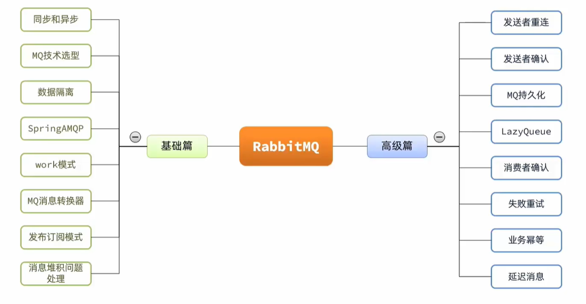
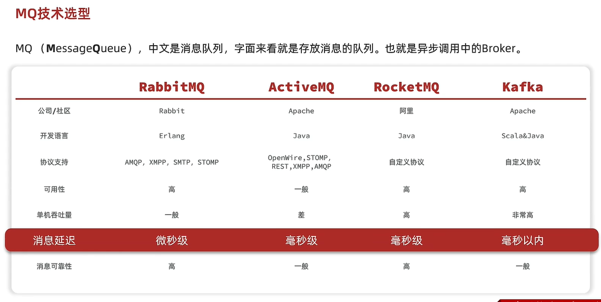
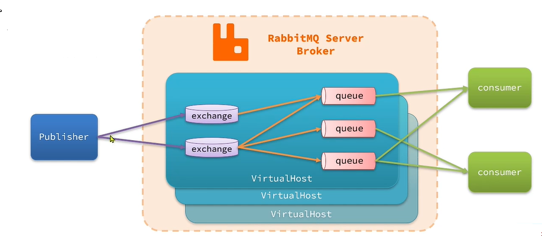
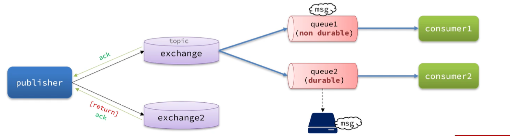

# 入门

## 1.简介

​		**RabbitMQ**是实现了高级[消息队列](https://baike.baidu.com/item/消息队列/4751675?fromModule=lemma_inlink)协议（[AMQP](https://baike.baidu.com/item/AMQP/8354716?fromModule=lemma_inlink)）的开源消息代理软件（亦称面向消息的[中间件](https://baike.baidu.com/item/中间件/452240?fromModule=lemma_inlink)）。RabbitMQ服务器是用[Erlang](https://baike.baidu.com/item/Erlang/0?fromModule=lemma_inlink)语言编写的，而集群和[故障转移](https://baike.baidu.com/item/故障转移/14768924?fromModule=lemma_inlink)是构建在[开放电信平台](https://baike.baidu.com/item/开放电信平台/15696499?fromModule=lemma_inlink)框架上的。所有主要的[编程语言](https://baike.baidu.com/item/编程语言/9845131?fromModule=lemma_inlink)均有与代理接口通讯的客户端库



## 2.异步调用

1. ###### 优势

   1. 耦合度低，拓展性强
   2. 异步调用，无需等待，性能好
   3. 故障隔离，下游服务故障不影响上游业务
   4. 缓存消息，流量肖峰填谷

2. 劣势

   1. 不能立即得到结果，时效性差
   2. 不确定下游业务执行是否成功
   3. 业务安全依赖于Broker的可靠性

## 3.技术选型




## 4.认识和安装

1. 基本介绍

   1. RabbitMQ的整体架构及核心概念

      - virtual-host：虚拟主机，起到数据隔离的作用

      - publisher：消息发送者

      - consumer：消息的消费者

      - queue：队列，存储消息

      - exchange：交换机，负责路由消息

        




生产者可靠性

- 生产者重连

  - 由于网络波动，可能会出现客户端连接MQ失败的情况。通过配置可以开启连接失败后的重连机制

  - ```yml
    spring:
    	rabbitmq:
    		connection-timeout: 1s # 设置MQ的连接超时时间
        	template:
        	  retry:
        	  	enable: true # 开启超时重试机制
        	  	initial-interval: 1000ms # 失败后的初始等待时间
        	  	multiplier: 1 # 失败后下次的等待时长倍数，下次等待时长 = initial-interval * multiplier
        	  	max-attempts: 3 # 最大重试次数
    ```


发送者可靠性

MQ的可靠性

消费者的可靠性

延迟消息

**安装**

1. ​	docker

   1. ```shell
      docker run -d --name rabbitmq -p 5672:5672 -p 15672:15672 rabbitmq:3-management
      ```

      解释：

      - `-d` 表示以守护进程模式运行容器。
      - `--name rabbitmq` 为容器指定一个名称。
      - `-p 5672:5672` 将容器的5672端口映射到宿主机的5672端口，RabbitMQ服务端口。
      - `-p 15672:15672` 将RabbitMQ管理界面的端口映射出来，方便在浏览器中访问。
      - `rabbitmq:3-management` 指定使用带有管理插件的RabbitMQ 3版本镜像。

      完成以上步骤后，RabbitMQ将在Docker容器中运行，并且其管理界面将可通过浏览器访问，默认用户和密码都是`guest`。

      如果需要进一步配置RabbitMQ，可以通过挂载配置文件或使用环境变量来实现。

   2. 账号密码

      1. guest::guest
      2. whhc::whhc@2019


## 5.快速入门

1. 快速入门
   1. **AMQP**(Advanced Message Queuing Protocol)高级消息队列，是用于在应用程序之间传递业务消息的开放标准。该协议与语言平台无关，更符合微服务中独立性的要求
   2. spring AMQP 是基于AMQP协议定义的一套API规范，提供了模板来发送和接收消息。包含两部分，其中spring-amqp是基础抽象，spring-rabbit是底层的默认实现
   3. 收发消息
      1. 引入spring-boot-start-amqp依赖
      2. 配置rabbitmq服务端消息
      3. 利用RabbitTemplate发送消息
      4. 利用RabbitListener注解声明要监听的队列，监听消息

2. **WorkQueue**

   1. 多个消费者绑定到一个队列，可以加快消息处理速度
   2. 同一条消息只会被一个消费者处理
   3. 通过设置prefetch来控制消费者预取的消息数量，处理完一条在处理下一条，实现能者多劳

3. > 

4. **Fanout**交换机（广播）

   1. 生命队列、交换机，并

5. **Direct**交换机（定向）

   > Direct 会将接收到的消息根据规则路由到指定的Queue，因此称为路由模式（routes）
   >
   > - 每一个Queue都与Exchange设置一个Bindingkey
   > - 发布者发送消息时，指定消息的Routingkey
   > - Exchange将消息路由到Bingdingkey与消息Routingkey一致的队列

   1. Direct Exchange会将接收到的消息根据规则路由到指定的queue，因此成为定向路由
   2. 每一个Queue都与Exchange设置一个BindingKey
   3. 发布者发送消息时，指定消息的RoutingKey
   4. Exchange将消息路由到BindingKey与消息RoutingKey一致的队列

6. **topic交换机**（话题）

   1. **发布订阅**（发布 Publish 和 订阅 Subscribe）

      > 发布订阅模式：允许将同一个消息发送给多个消费者。实现方式就是加入了exchange（交换机）
   2. TopicExchange与DirectExchange类似，区别在于routingKey可以是多个单词的列表，并且以"."分割。
   3. Queue和Exchange指定BindingKey时可以使用通配符：
      1. #: 代指0个或多个单词
      2. *: 代指一个单词

7. 声明队列和交换机

   1. SpringAMQP提供了几个类，用来声明队列和交换机及其绑定关系

      1. Queue：用于声明队列，可以用工厂类QueueBuilder构建
      2. Exchange：用于声明交换机，可以用工厂类EchangeBuilder构建
      3. Bingding：用于声明队列和交换机的绑定关系，可以用工厂类BindingBuilder构建

   2. 案例

      1. 声明一个Fanout类型的交换机，并且创建队列与其绑定：

         ```java
         @Configuration
         public class FanoutConfig{
             // 声明FanoutExchange交换机
             @Bean
             public FanoutExchang fanoutExchange(){
                 return new FanoutExchange("whhc.fanout");
             }
             
             // 声明一个队列
             @Bean
             public Queue fanoutQueue1(){
                 return new Queue("fanout.queue1");
             }
             
             // 绑定队列和交换机
             @Bean
             public Binding bindingQueue1(Queue fanoutQueue1, FanoutExchange fanoutExchange){
                 return BindingBuilder.bind(fanoutQueue1).to(fanoutExchange);
             }
             // ...略，以相同方式声明第2个队列，并完成绑定
         }
         ```

         

      2. 基于RabbitListener注解来声明队列和交换机的方式

         

      3. 

8. 消息转换器

9. 交换机的作用

   1. 接收publisher发送的消息
   2. 将消息按照规则路由到与之绑定的队列
   3. FanoutExchange的会将消息路由到每个绑定的队列

## **6.应用场景**

> **RabbitMQ 的优势在于提供了可靠的消息传递机制、异步处理能力以及系统解耦的特性。其广泛的应**

### 6.1. **任务异步处理**

- **场景**：在 Web 应用中，用户提交请求后不希望立即等待系统完成复杂计算或数据处理，可以将这些任务交给后台处理。
- **示例**：用户上传文件后，系统需要对文件进行压缩、格式转换或分析等复杂操作。通过 RabbitMQ，将任务放入消息队列，由后台消费者异步处理，不会阻塞用户操作。
- **优点**：提高响应速度，解耦前端请求与后端任务的处理。

### 6.2. **订单处理**

- **场景**：电商平台在用户下单时，系统需要处理订单支付、库存扣减、发货等多个步骤。如果这些步骤依赖于同步执行，可能会导致延迟和阻塞。
- **示例**：用户下单后，生成订单并将其发送到 RabbitMQ 队列，多个消费者处理不同的订单步骤（例如，支付确认、库存更新、发货通知等）。
- **优点**：解耦各个模块的逻辑，提供更高的可扩展性和容错性，避免单点故障。

### 6.3. **日志收集与处理**

- **场景**：在分布式系统中，不同的服务或应用产生大量日志数据。将日志数据集中处理有助于实时分析和报警。
- **示例**：各个服务将日志信息发送到 RabbitMQ 队列，专门的日志收集服务从队列中消费日志数据并进行存储、分析或展示。
- **优点**：集中式日志管理，易于分析和处理，便于扩展和维护。

### 6.4. **分布式通知系统**

- **场景**：当系统中的某些事件发生时，需要通知多个不同的系统或服务。比如，用户注册成功后，系统可能需要通知邮件服务、短信服务、推送服务等。
- **示例**：用户注册后，系统将注册事件发送到 RabbitMQ 队列，多个消费者分别处理邮件、短信和推送等通知任务。
- **优点**：解耦系统，减少各个模块之间的依赖，能够灵活地增加新的通知方式。

### 6.5. **数据同步**

- **场景**：在分布式系统中，多个数据库或服务之间需要同步数据。RabbitMQ 可以作为数据同步的消息中间件。
- **示例**：当主数据库发生数据变动时，变化信息通过 RabbitMQ 发送到其他数据库或服务，保证数据的实时同步。
- **优点**：实现松耦合的实时数据同步，提高系统可靠性。

### 6.6. **实时数据流处理**

- **场景**：需要对大量实时数据进行处理的场景，例如实时用户行为分析、设备数据采集等。
- **示例**：通过 RabbitMQ 收集来自设备或用户端的实时数据流，消费者负责处理数据并进行统计或分析。
- **优点**：通过异步处理分担计算压力，确保系统能够处理高吞吐量的实时数据。

### 6.7. **延迟任务**

- **场景**：某些任务需要在指定的延迟时间后执行。例如，定时任务、预约任务等。
- **示例**：用户预约服务后，系统可以将任务发送到 RabbitMQ，并设置延迟时间，消费者在延迟时间到达后执行相应的操作（如发送提醒、处理用户请求等）。
- **优点**：通过 RabbitMQ 内置的延迟队列功能，可以轻松实现任务的延迟处理。

### 6.8. **流量控制与限流**

- **场景**：对于某些高并发操作，直接处理请求可能导致系统过载。可以通过消息队列进行流量控制。
- **示例**：使用 RabbitMQ 对请求进行排队，保证消费者能够按照系统的吞吐能力处理请求，避免过载。
- **优点**：通过队列控制流量，避免系统过载，提高系统稳定性。

### 6.9. **事务处理与补偿机制**

- **场景**：在分布式系统中，可能会发生事务处理失败的情况，需要进行补偿处理。
- **示例**：在金融交易系统中，用户资金转移可能涉及多个操作（扣款、存款、通知等）。使用 RabbitMQ 发送事件消息，在各个步骤完成后，若某一步骤失败，通过回滚和补偿操作进行恢复。
- **优点**：实现最终一致性，保证事务的可靠性。

### 6.10. **消息广播与发布订阅**

- **场景**：系统需要向多个服务或客户端推送相同的信息。
- **示例**：某些系统事件（例如，价格变动、库存更新等）需要实时通知多个消费者（例如，应用、后台服务、短信推送服务等）。使用 RabbitMQ 的发布/订阅模式，将消息广播到所有订阅的队列。
- **优点**：高效的消息分发机制，能够处理多对多的通信。

### 6.11. **视频处理和转码**

- **场景**：视频上传和处理系统中，视频转码等操作可能需要消耗大量资源，应该放入后台异步处理。
- **示例**：用户上传视频后，视频文件存储在云端或文件服务器，消息队列接收到视频处理任务后，转码服务从队列中消费任务，进行视频转码、缩略图生成等操作。
- **优点**：任务异步处理，避免阻塞用户操作，系统可扩展性强。

### 6.12. **定时任务调度**

- **场景**：在一些应用中，需要定期执行任务，例如定期清理数据库过期数据，或定时发送系统报告。
- **示例**：通过 RabbitMQ 配合定时任务调度系统（如 Quartz），将定时任务消息发送到队列，由后台服务定时消费执行。
- **优点**：通过消息队列集中管理定时任务，易于扩展和监控。


# 高级

1. 发送者可靠性

   1. 生产者重连

      1. 有时由于网络波动，可能会出现客户端连接MQ失败的情况。通过配置我们可以开启连接失败后的重连机制

         ```yaml
         spring:
         	rabbitmq:
         		connection-timeout: 1s #设置MQ的连接超时时间
         		template:
         			retry:
         			  enable: true # 开启超时重试机制
         			  initial-interval: 1000ms # 失败后的初始等待时间
         			  multiplier: 1 # 失败后下次的等待时长倍数，下次等待时长 = initial-interval * multiplier
         			  max-attempts: 3
         ```

         > 注：当网络不稳定的时候，利用重试机制可以有效提高消息发送的效率。不过SpringAMQP提供的重试机制时阻塞式的重试，也就是说多次重试等待的过程中，当前线程是被阻塞的，会影响业务性能。
         >
         > ​	如果对于业务性能有要求，建议禁用重试机制。如果一定要使用，请合理配置等待时长和重试次数，当然也可以考虑使用异步线程来执行发送消息的代码

   2. 生产者确认

      1. RabbitMQ Publisher confirm和publisher return 两种确认机制。开启确认机制后，在MQ成功收到消息后会返回确认消息给生产者。返回的结果有以下几种情况

         1. 消息投递到了MQ，但是路由失败。此时通过publisherReturn返回路由异常原因，然后返回ACK，告知投递成功（一般不会，由开发人员造成）
         2. 临时消息投递到了MQ，并且入队成功，返回ACK，告知投递成功
         3. 持久消息投递到了MQ，并且入队完成持久化，返回ACK，告知投递成功
         4. 其它情况都会返回NACK，告知投递失败

         

         1. 在publisher这个微服务的application.yml中配置：

            ```yml
            spring:
            	rabbitmq:
            		publisher-confirm-type: correlated # 开启publisher confirm机制，并设置confirm类型
            		publisher-returns: true # 开启publisher return机制
            ```

            

         2. 

2. MQ的可靠性

   1. 生产者可靠性
   2. MQ可靠性
      1. 数据持久化
      2. LazyQueue
   3. 消费者可靠性

3. 消费者的可靠性

4. 延迟消息


https://www.bilibili.com/video/BV1mN4y1Z7t9?p=1


# 注

概念

- channel：操作MQ的工具
- exchange：路由消息到队列中
- queue：缓存消息
- virtual host：虚拟主机，是对queue、exchange等资源的逻辑分组